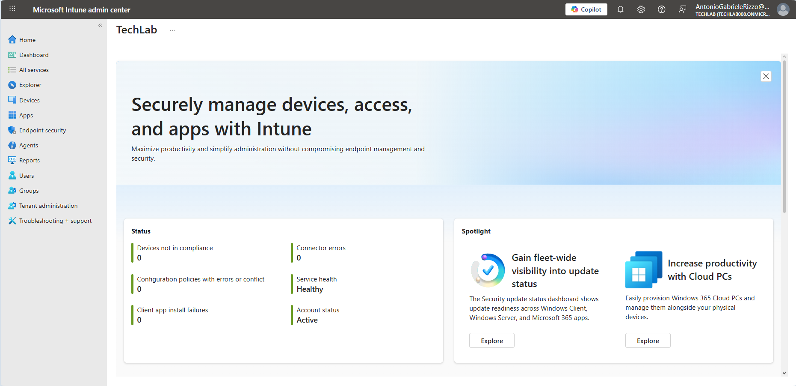
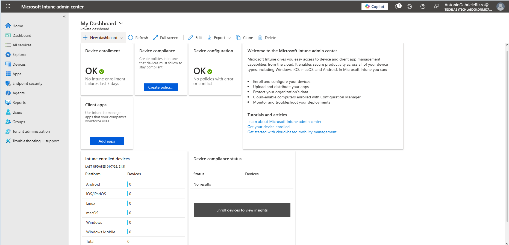
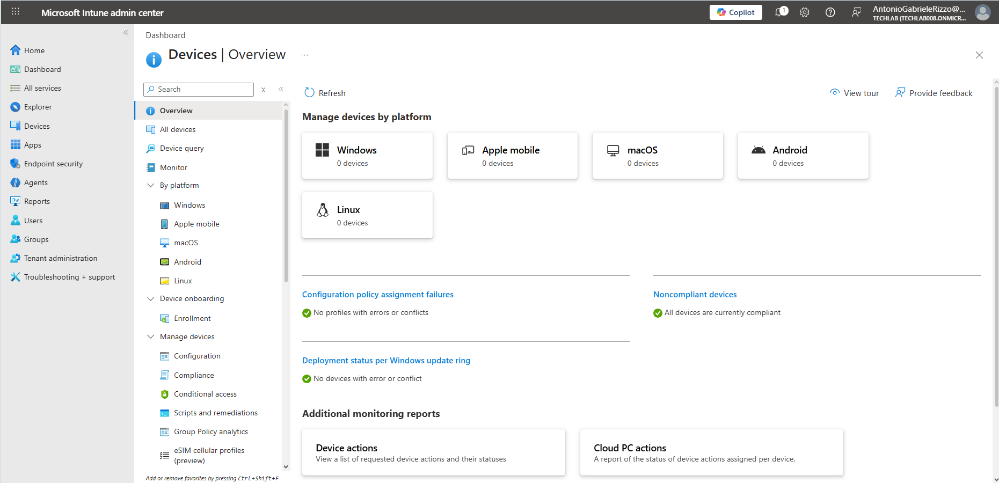
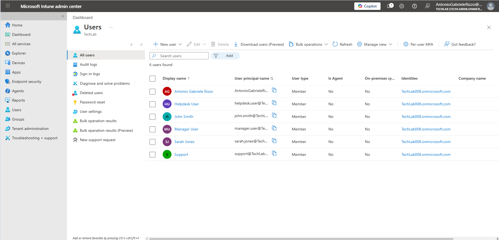
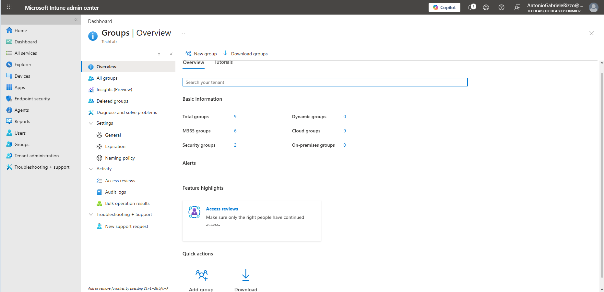
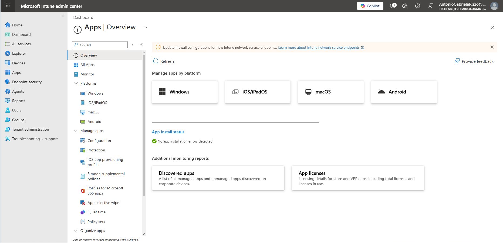
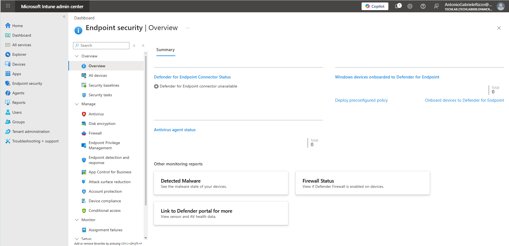
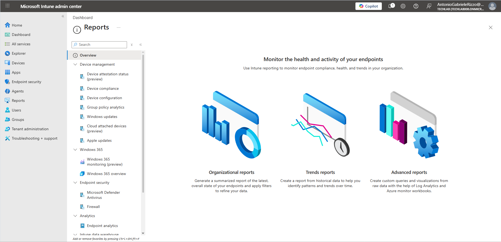
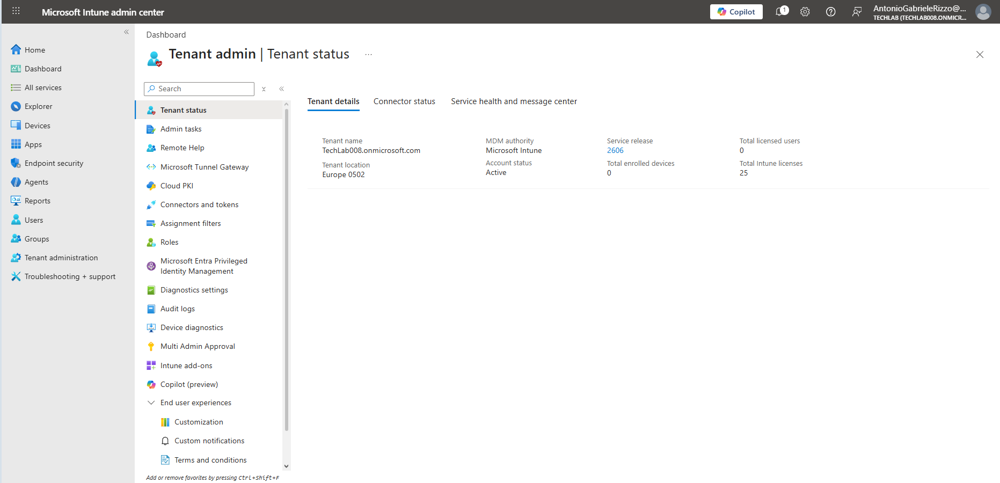

# Intune Administration Center Overview

## Introduction

The Microsoft Intune Admin Center is the central portal used to manage devices, applications, security policies and endpoint compliance.

This chapter introduces the main areas of the Microsoft Intune Admin Center and explains their purpose. No configuration changes are performed during this chapter.

Understanding the portal layout is essential before enrolling devices and creating policies in later chapters.

---

# Objectives

By completing this chapter you will learn how to:

- Navigate the Microsoft Intune Admin Center
- Understand the purpose of the Dashboard
- Locate device management features
- Locate user and group management
- Explore application management
- Understand Endpoint Security
- Locate reporting tools
- Explore Tenant Administration

---

# Prerequisites

Before starting this chapter, ensure you have:

- Microsoft Intune Plan 1 Trial activated
- Access to the Microsoft Intune Admin Center
- Global Administrator or Intune Administrator permissions

---

# Microsoft Intune Admin Center

The Microsoft Intune Admin Center is Microsoft's cloud portal used to manage organisational devices and applications.

It provides administrators with a single location to:

- Manage enrolled devices
- Deploy applications
- Configure security policies
- Monitor compliance
- Generate reports
- Perform remote administrative actions

After successfully activating Microsoft Intune, administrators can access the portal by visiting:

```text
https://intune.microsoft.com
```



---

# Dashboard

The Dashboard provides a quick overview of the current Microsoft Intune environment.

From this page administrators can immediately identify:

- Device enrolment status
- Compliance status
- Configuration status
- Application status
- General tenant health

When managing large numbers of devices, the dashboard provides a useful summary of the environment.



---

# Devices

The **Devices** section is where administrators manage enrolled devices.

From this area it is possible to:

- View all managed devices
- Monitor device health
- Organise devices by platform
- Create compliance policies
- Deploy configuration profiles
- Perform remote management actions

Supported platforms include:

- Windows
- Android
- Apple mobile (iOS/iPadOS)
- macOS
- Linux

As this is a newly created laboratory, no devices have been enrolled yet.



---

# Users

The **Users** section displays Microsoft Entra ID users that can access organisational resources.

Administrators can:

- View users
- Assign licenses
- Review user devices
- Troubleshoot user-related issues

In later chapters, users will be assigned Microsoft Intune licenses before enrolling devices.



---

# Groups

Groups simplify administration by allowing policies and applications to be assigned to multiple users or devices simultaneously.

Rather than configuring each user individually, administrators assign resources to groups.

Microsoft Intune supports:

- User groups
- Device groups

Groups will be used throughout this repository to deploy policies and applications.



---

# Apps

The **Apps** section is used to deploy and manage software across enrolled devices.

Administrators can:

- Add applications
- Assign required applications
- Publish available applications
- Monitor application deployment

Later chapters will demonstrate deploying Microsoft applications such as Microsoft Edge and Microsoft Authenticator.



---

# Endpoint Security

The **Endpoint Security** section centralises security configuration for managed devices.

Examples include:

- Microsoft Defender
- Antivirus policies
- Firewall settings
- Security Baselines
- Disk Encryption

These features help organisations secure their managed endpoints.



---

# Reports

The **Reports** section provides administrators with information about the health of the Microsoft Intune environment.

Reports can be used to review:

- Device compliance
- Device inventory
- Application deployment
- Policy status
- Enrolment statistics

Reporting assists administrators when monitoring large device deployments.



---

# Tenant Administration

The **Tenant Administration** section contains settings that apply to the Microsoft Intune environment.

Typical administrative tasks include:

- Managing tenant settings
- Customising notifications
- Reviewing connector status
- Configuring organisational preferences

These settings affect the entire Microsoft Intune tenant.



---

# Key Learnings

By completing this chapter you have learned how to:

- Navigate the Microsoft Intune Admin Center
- Locate the major administrative sections
- Understand the purpose of each management area
- Prepare for device enrolment and policy deployment

---

# Skills Developed

- Microsoft Intune navigation
- Endpoint management fundamentals
- Administrative portal familiarity
- Microsoft Intune administration

---

# Interview Tip

A Junior Microsoft Intune Administrator should be be able to explain the purpose of the main areas of the Microsoft Intune Admin Center, including Devices, Users, Groups, Apps, Endpoint Security, Reports and Tenant Administration.

Understanding where administrative tasks are performed is an important foundation before configuring devices and security policies.

---

# Chapter Summary

In this chapter you explored the Microsoft Intune Admin Center and became familiar with the main administrative areas used to manage an organisation's devices.

The following areas were introduced:

- Dashboard
- Devices
- Users
- Groups
- Apps
- Endpoint Security
- Reports
- Tenant Administration

The next chapter prepares users and groups for device enrolment by assigning licenses and creating the administrative structure required for Microsoft Intune.