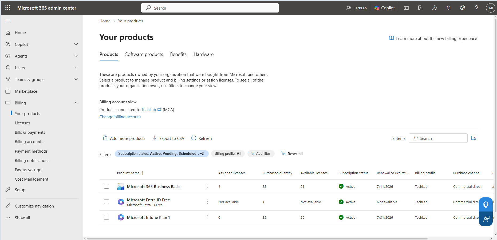
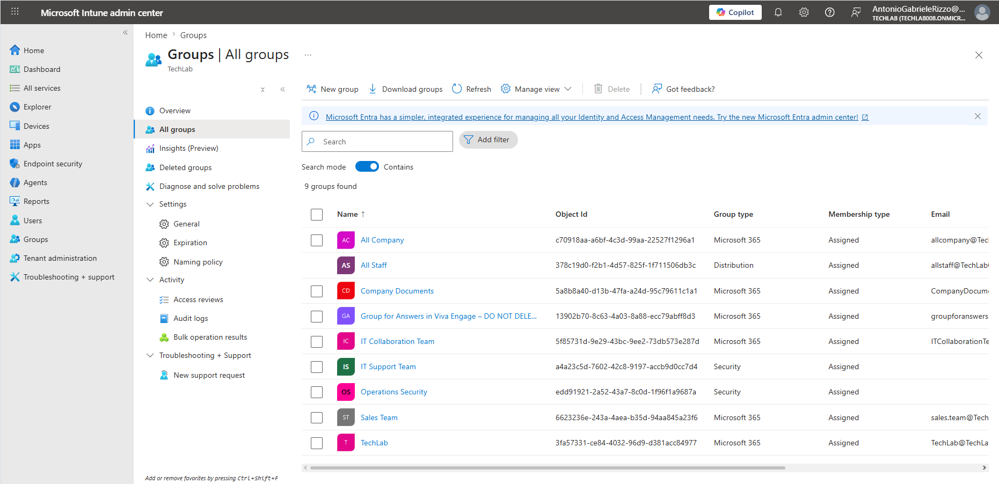
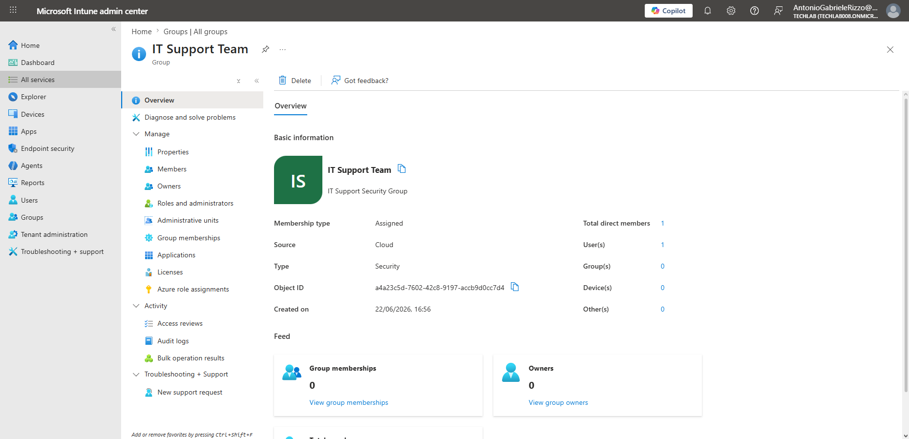
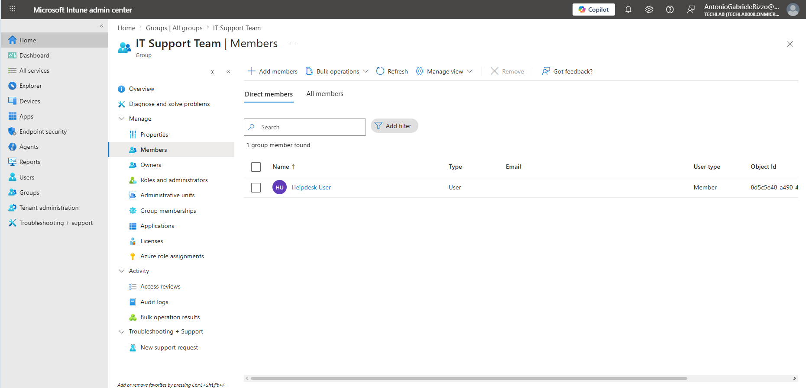
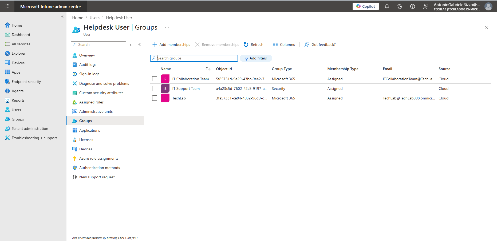
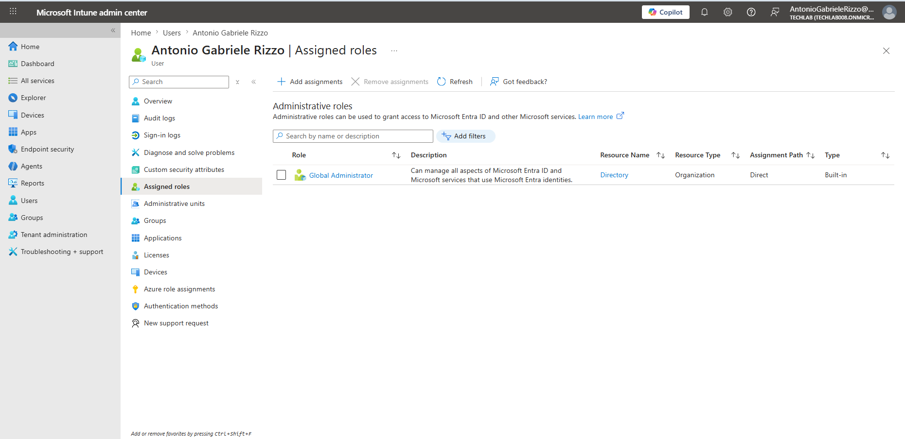
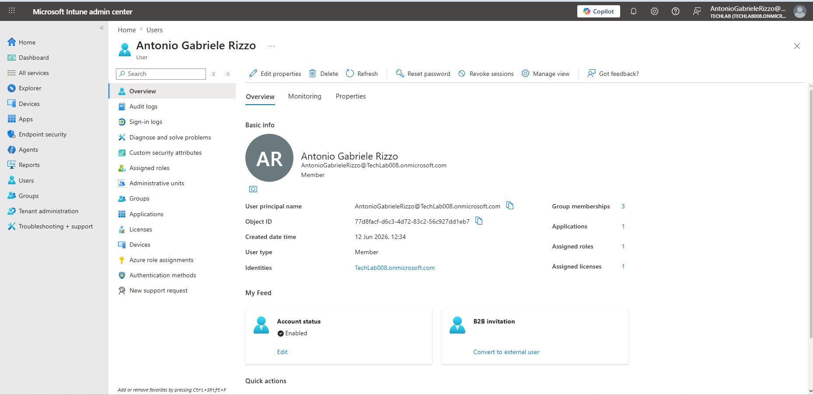

# User and Group Preparation

## Introduction

Before devices can be enrolled into Microsoft Intune, the appropriate users and groups must be prepared.

Microsoft Intune does not maintain its own identity database. Instead, it relies on Microsoft Entra ID to provide user identities, Security Groups and administrative roles.

This integration allows administrators to deploy applications, assign compliance policies, configure devices and manage security using existing Microsoft Entra ID identities.

Preparing users and Security Groups before enrolling devices helps ensure that applications and policies can be assigned efficiently while maintaining a consistent administrative structure.

In this chapter, the users and Security Groups created during the Microsoft Entra ID laboratory are reviewed and verified to ensure the Microsoft Intune environment is ready for device enrolment.

---

# Objectives

After completing this chapter, I will be able to:

- Review the existing Microsoft Entra ID users.
- Verify the Microsoft Intune subscription.
- Review existing Security Groups.
- Verify group membership.
- Review administrative roles.
- Confirm that the Microsoft Intune environment is ready for device enrolment.

---

# Prerequisites

Before starting this chapter, I had already:

- Completed Chapter 01 – Creating the Intune Lab Environment.
- Completed Chapter 02 – Intune Administration Center Overview.
- Activated Microsoft Intune Plan 1 Trial.
- Signed in using a Global Administrator account.

---

# Why Users and Groups Are Important

Microsoft Intune uses Microsoft Entra ID to identify users and control access to organisational resources.

Whenever a device is enrolled, it becomes associated with a user account. This relationship enables administrators to deploy applications, assign compliance policies, configure security settings and monitor devices throughout their lifecycle.

Rather than assigning policies individually, organisations normally assign them to Security Groups. Every member of the group automatically receives the assigned applications and policies, making administration considerably easier and reducing the risk of configuration errors.

Because the Security Groups were already created during the Microsoft Entra ID laboratory, they can now be reused throughout the remainder of this repository.

---

# Viewing Existing Users

Navigate to:

```text
Microsoft Intune Admin Center

Users
    └── All users
```

The **Users** page displays every Microsoft Entra ID account available within the tenant.

Although user accounts are created in Microsoft Entra ID, they are also visible from the Microsoft Intune Admin Center because both services share the same identity platform.

From this page administrators can review important information including:

- User accounts
- Assigned licences
- Assigned administrative roles
- Account status
- Contact information

During this repository these users will be used to enrol devices, receive applications and evaluate compliance policies.

No changes are required at this stage because the accounts were prepared during the Microsoft Entra ID laboratory.


---

# Verifying the Microsoft Intune Subscription

Before devices can be enrolled, the Microsoft Intune subscription must be available within the Microsoft 365 tenant.

Navigate to:

```text
Microsoft 365 Admin Center

Billing
    └── Your products
```

Review the list of available subscriptions and confirm that **Microsoft Intune Plan 1** is listed as **Active**.

This confirms that the tenant is licensed to manage devices using Microsoft Intune.

Without an appropriate licence, devices cannot be enrolled or managed.

Although Microsoft Intune supports several licensing models, the **Microsoft Intune Plan 1 Trial** provides every feature required for this laboratory.



---

# Reviewing Existing Security Groups

Navigate to:

```text
Microsoft Intune Admin Center

Groups
    └── All groups
```

Security Groups are one of the most important administrative features within Microsoft Intune.

Rather than assigning applications, compliance policies or configuration profiles individually, administrators normally assign them to Security Groups.

Any user who becomes a member of the group automatically receives the assigned resources, making administration more efficient and ensuring a consistent configuration across multiple users and devices.

Locate the **IT Support Team** Security Group created during the Microsoft Entra ID laboratory.



---

# Reviewing the IT Support Team Security Group

Open the **IT Support Team** Security Group.

The Overview page provides information about the group, including:

- Group name
- Group type
- Membership type
- Creation date
- Number of members

Reviewing the Overview page confirms that the Security Group was created successfully and is ready to be used throughout the Microsoft Intune laboratory.

This Security Group will be reused in later chapters when deploying applications, assigning compliance policies and configuring device settings.

Using an existing Security Group also reflects how Microsoft Intune is typically deployed in enterprise environments, where identities and groups are usually created before endpoint management begins.



---

# Reviewing Group Membership

After confirming that the **IT Support Team** Security Group exists, the next step is to verify its membership.

Open the group and navigate to:

```text
Members
```

The **Members** page displays every user currently assigned to the Security Group.

Reviewing group membership is an important administrative task because Microsoft Intune frequently deploys applications, compliance policies and configuration profiles to Security Groups rather than individual users.

Using groups makes administration simpler, improves consistency and reduces the amount of manual configuration required when additional users join the organisation.

For this laboratory, the **Helpdesk User** account is already a member of the **IT Support Team** Security Group.

This confirms that the group is ready to receive future assignments.



---

# Reviewing User Group Membership

It is also useful to verify group membership from the user's perspective.

Navigate to:

```text
Microsoft Intune Admin Center

Users
    └── Helpdesk User
            └── Groups
```

The **Groups** page displays every Microsoft Entra ID group to which the selected user belongs.

Reviewing user membership confirms that the correct Security Groups have been assigned before applications and policies are deployed.

If a user is missing from the appropriate Security Group, any applications or compliance policies assigned to that group will not be applied.

The **Helpdesk User** account is correctly assigned to the **IT Support Team** Security Group.



---

# Reviewing Administrative Roles

Microsoft Entra ID controls administrative permissions for Microsoft Intune.

Navigate to:

```text
Microsoft Intune Admin Center

Users
    └── Antonio Gabriele Rizzo
            └── Assigned roles
```

The **Assigned roles** page displays the directory roles assigned to the administrator account.

Administrative roles determine which management tasks can be performed within Microsoft Intune and other Microsoft cloud services.

For this laboratory, the administrator account has the permissions required to manage the Microsoft Intune environment.

Reviewing administrative roles before enrolling devices is considered good administrative practice because it confirms that sufficient permissions are available to complete future configuration tasks.



---

# Confirming the Environment Is Ready for Device Enrolment

Before enrolling a device, it is useful to perform one final review of the administrator account.

Navigate to:

```text
Microsoft Intune Admin Center

Users
    └── Antonio Gabriele Rizzo
            └── Overview
```

The **Overview** page provides a summary of the account, including:

- Account status
- Assigned licence
- Assigned directory role
- Group memberships
- Contact information

Reviewing this information confirms that the laboratory environment has been prepared correctly and that no additional user configuration is required before beginning device enrolment.

The Microsoft Intune environment is now ready for the practical configuration tasks covered in the following chapters.



---

# Key Learnings

- Microsoft Intune uses Microsoft Entra ID to provide user identities and Security Groups.
- Every managed device is associated with a Microsoft Entra ID user account.
- Security Groups simplify the deployment of applications, compliance policies and configuration profiles.
- Reviewing group membership helps ensure users receive the correct assignments.
- Administrative roles determine which management tasks can be performed.
- Verifying the environment before device enrolment helps prevent configuration issues.

---

# Skills Demonstrated

- Microsoft Entra ID user administration
- Security Group administration
- Microsoft Intune licence verification
- Administrative role verification
- User preparation for device enrolment
- Technical documentation using GitHub and Markdown

---

# Interview Tip

For junior Microsoft Intune and IT Support roles, it is important to understand that Microsoft Intune does not manage identities independently.

Users, Security Groups and administrative roles are provided by Microsoft Entra ID and are reused throughout Microsoft Intune when deploying applications, assigning policies and managing enrolled devices.

Understanding how these Microsoft cloud services work together demonstrates a solid understanding of modern endpoint management.

---

# Chapter Summary

In this chapter, the existing Microsoft Entra ID users and Security Groups were reviewed to prepare the Microsoft Intune laboratory for device enrolment.

The Microsoft Intune subscription was verified, Security Group membership was confirmed, administrative roles were reviewed and the administrator account was validated before enrolling the first managed device.

With the environment fully prepared, the next chapter focuses on enrolling a physical Android device into Microsoft Intune using the Microsoft Company Portal application.
