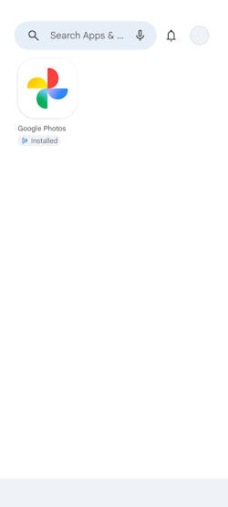

# 05 – Deploying Android Applications with Managed Google Play

## Introduction

After successfully enrolling an Android Enterprise device into Microsoft Intune, the next step is deploying applications to managed devices.

Microsoft Intune integrates with **Managed Google Play**, allowing administrators to discover, approve and deploy Android Enterprise applications directly from the Intune Admin Center. Once approved, applications can be assigned to users or devices using Microsoft Entra Security Groups, enabling consistent software deployment across the organisation.

Unlike traditional application management, Managed Google Play provides a secure method of distributing approved applications without requiring users to manually install software from the public Google Play Store. Administrators retain control over which applications are available and how they are deployed.

In this chapter, I integrated Microsoft Intune with Managed Google Play, imported **Google Photos** as an Android Enterprise application, created a dedicated deployment Security Group, assigned the application as a **Required** deployment and verified that the application was automatically installed on my enrolled Android device.

---

# Objectives

After completing this chapter, I will be able to:

- Access the Android application management area within Microsoft Intune.
- Browse Managed Google Play applications.
- Import Android Enterprise applications.
- Create a deployment Security Group.
- Assign Android applications to Microsoft Entra groups.
- Configure Required application deployments.
- Synchronise Managed Google Play with Microsoft Intune.
- Verify successful application deployment.
- Troubleshoot application synchronisation issues.

---

# Prerequisites

Before starting this chapter, I had already:

- Completed Chapter 01 – Creating the Intune Lab Environment.
- Completed Chapter 02 – Intune Administration Center Overview.
- Completed Chapter 03 – User and Group Preparation.
- Completed Chapter 04 – Android Device Enrolment.
- Successfully enrolled an Android Enterprise device using Microsoft Company Portal.
- Configured Android Enterprise within Microsoft Intune.

---

# Android Enterprise Applications

Microsoft Intune supports several Android application types depending on the deployment scenario.

Android Enterprise applications are distributed through **Managed Google Play**, allowing organisations to deploy approved applications without requiring users to search the public Google Play Store themselves.

Navigate to:

```text
Microsoft Intune Admin Center

Apps
    └── Android
```

The **Android** applications page displays all Android applications currently managed by Microsoft Intune.

Initially, no business applications had been imported into the tenant.


---

# Creating an Android Enterprise Application

To deploy an Android application, a new application must first be added to Microsoft Intune.

Navigate to:

```text
Apps
    └── Android
            └── Add
```

Microsoft Intune supports several Android application types, including Store apps, Line-of-Business (LOB) applications and Web links.

For this laboratory, I selected **Managed Google Play app**, which integrates directly with the organisation's Managed Google Play environment.


The next step was selecting the appropriate application category.

For Android Enterprise deployments, the **Managed Google Play app** category provides access to applications that can be approved and synchronised directly with Microsoft Intune.


# Accessing Managed Google Play

Selecting **Managed Google Play app** opens the embedded Managed Google Play interface within Microsoft Intune.

Managed Google Play acts as the enterprise application catalogue for Android Enterprise devices. Instead of uploading installation files manually, administrators can browse Google's managed catalogue, approve applications for organisational use and synchronise them directly with Microsoft Intune.

This integration simplifies Android application management by ensuring approved applications can be deployed securely to managed devices.


---

# Importing an Android Application

For this laboratory, I selected **Google Photos** as the application to deploy to my enrolled Android device.

Using the search function within Managed Google Play, I located the application and opened its information page.


The application page provides information including:

- Application publisher
- Description
- Available permissions
- Version information
- Store category

Selecting **Approve** authorises the application for organisational use within Microsoft Intune.


---

# Synchronising Managed Google Play

Approving an application within Managed Google Play does **not** immediately make it available inside Microsoft Intune.

One behaviour I observed during this laboratory is that selecting **Approve** provides very little visual feedback. Although the application is approved within Managed Google Play, it does not automatically appear in the Intune Admin Center.

To complete the import process, I manually initiated a **Managed Google Play synchronisation** from Microsoft Intune.

After the synchronisation completed, **Google Photos** became available as a managed Android Enterprise application.


> **Troubleshooting Note**
>
> If an approved Android Enterprise application does not appear within Microsoft Intune, manually synchronise **Managed Google Play** before attempting to import or assign the application again. During this laboratory, this manual synchronisation was required before Google Photos became visible within the Android application list.

---

# Creating a Deployment Group

Rather than assigning applications directly to individual users, Microsoft Intune commonly uses Microsoft Entra Security Groups.

Using Security Groups simplifies application management because users automatically receive assigned applications when they become members of the appropriate deployment group.

For this chapter, I created a dedicated Security Group named **Android Test Users** to receive Android Enterprise application deployments.


After creating the group, I added my test account to the membership.


Finally, I reviewed the group membership to verify that the user had been added successfully.


# Assigning the Application

Once the application had been synchronised into Microsoft Intune, the next step was assigning it to the deployment group.

Opening the **Google Photos** application displays several assignment options that determine how the application is delivered to managed devices.

The available assignment types include:

- **Available for enrolled devices** – Users can install the application from the Company Portal.
- **Required** – Microsoft Intune automatically installs the application on assigned devices.
- **Uninstall** – Removes the application from assigned devices.

For this laboratory, I selected the **Required** assignment type to ensure the application would be installed automatically without user interaction.


---

# Selecting the Deployment Group

Microsoft Intune allows assignments to users or Security Groups.

Rather than targeting individual users, I assigned the application to the **Android Test Users** Security Group created earlier in this chapter.

Using Security Groups provides a scalable deployment model because administrators only need to manage group membership instead of configuring application assignments for every individual user.

After selecting the Security Group, I completed the assignment configuration.


---

# Reviewing the Application Assignment

After saving the configuration, Microsoft Intune updated the application with the newly configured deployment.

Reviewing the application confirmed that:

- The application had been successfully imported.
- The deployment assignment was configured.
- The **Android Test Users** Security Group was targeted.
- The deployment type was **Required**.

This confirmed that Microsoft Intune was ready to deliver the application to every managed Android device belonging to members of the assigned Security Group.


---

# Verifying Application Deployment

After allowing Microsoft Intune sufficient time to process the assignment, I verified the deployment on my enrolled Android Enterprise device.

The managed work profile automatically received **Google Photos**, demonstrating that the Required deployment had been processed successfully.

No manual installation from the Google Play Store or Company Portal was required because Microsoft Intune performed the installation automatically in the background.

This confirmed that communication between Microsoft Intune, Managed Google Play and the enrolled Android Enterprise device was functioning correctly.



---

# Key Learnings

- Managed Google Play provides the approved enterprise application catalogue for Android Enterprise devices.
- Android Enterprise applications must be approved before they can be deployed through Microsoft Intune.
- Approved applications require a manual **Managed Google Play synchronisation** before they become available within Microsoft Intune.
- Microsoft Entra Security Groups provide a scalable method for deploying applications to multiple users.
- **Required** assignments automatically install applications on managed Android devices without user interaction.
- Verifying application deployment confirms successful communication between Microsoft Intune, Managed Google Play and enrolled Android Enterprise devices.

---

# Skills Demonstrated

- Android Enterprise application deployment
- Managed Google Play administration
- Mobile Application Management (MAM)
- Microsoft Intune application management
- Microsoft Entra Security Group administration
- Application assignment configuration
- Required application deployments
- Application deployment verification
- Technical documentation using GitHub and Markdown

---

# Interview Tip

For junior Microsoft Intune and IT Support roles, it is important to understand that approving an application in **Managed Google Play** does not automatically make it available within Microsoft Intune.

Administrators must synchronise **Managed Google Play** with Microsoft Intune before newly approved applications appear in the Android application catalogue. This is a common issue encountered during Android Enterprise administration and is often the first troubleshooting step when an approved application cannot be found.

Understanding the relationship between Microsoft Intune, Managed Google Play and Microsoft Entra Security Groups demonstrates practical knowledge of Android Enterprise application deployment in a modern endpoint management environment.

---

# Chapter Summary

In this chapter, I successfully deployed an Android Enterprise application using **Managed Google Play** and Microsoft Intune.

I imported **Google Photos** from the Managed Google Play catalogue, synchronised the application with Microsoft Intune, created a dedicated **Android Test Users** Security Group and configured a **Required** deployment assignment.

Finally, I verified that the application was automatically installed on my enrolled Android Enterprise device, confirming that Microsoft Intune, Managed Google Play and Microsoft Entra ID were working together to deliver applications to managed endpoints successfully.


